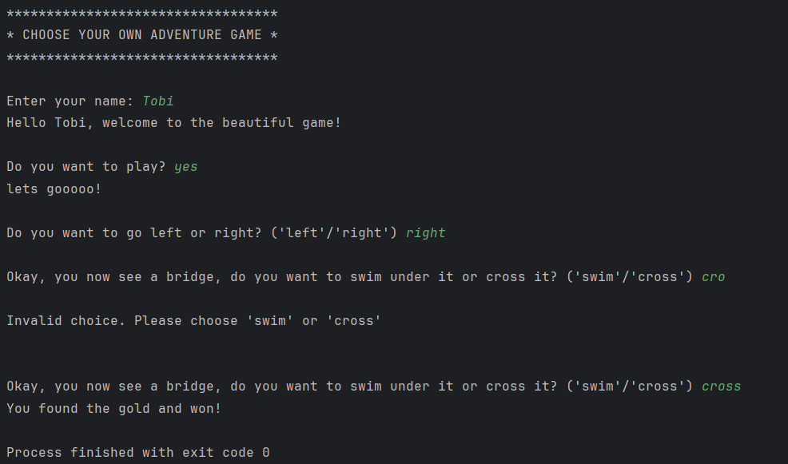

 
  <h1>Choose Your Own Adventure Game</h1>

  

## Background
"Choose Your Own Adventure" is an interactive text-based game where the player is presented with a series of choices. 
The goal is to navigate through different scenarios and make the right decisions to succeed in the adventure.

At the start of the game, the player is given an introduction and a choice of direction: to go left or right. If the player chooses to go left, they fall off a cliff and lose the game. 
If the player chooses to go right, they encounter a bridge and must decide whether to swim under it or cross it. 
Choosing to swim results in being eaten by an alligator and losing the game, while crossing the bridge leads to finding gold and winning the game.

  

  

## Rules
- The player starts by choosing whether they want to play.
- The player is asked to make decisions at each point, such as which direction to go or how to handle obstacles.
- If the player makes a wrong decision (like falling off a cliff or getting eaten by an alligator), the game ends.
- If the player makes the right decision (like finding the gold), they win the game.
- Invalid inputs will prompt the player to try again until a valid choice is made.

  
